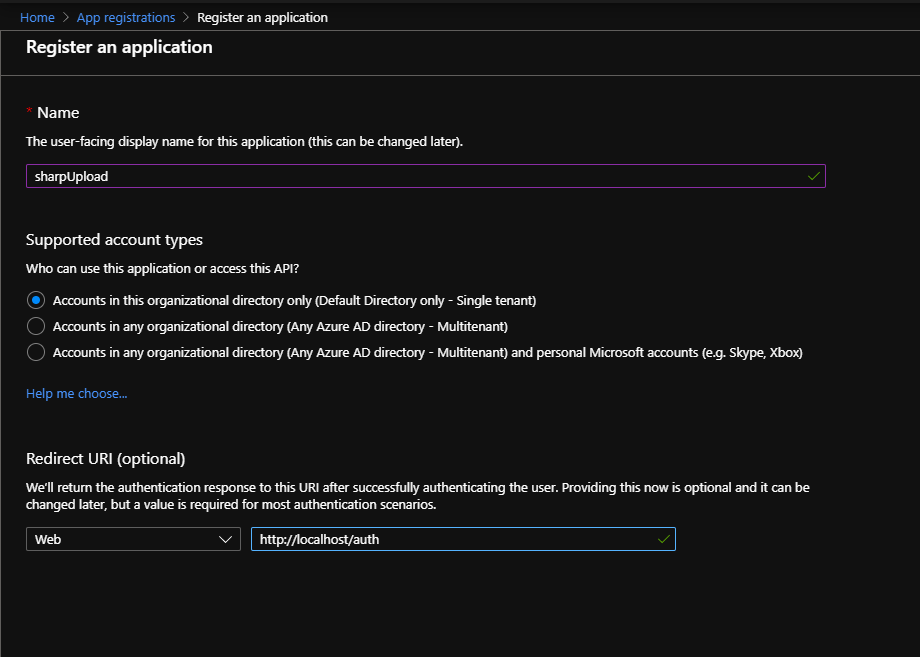
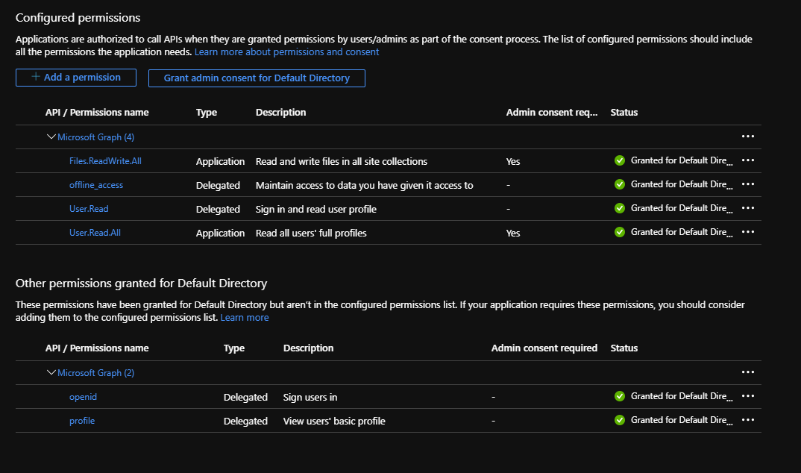
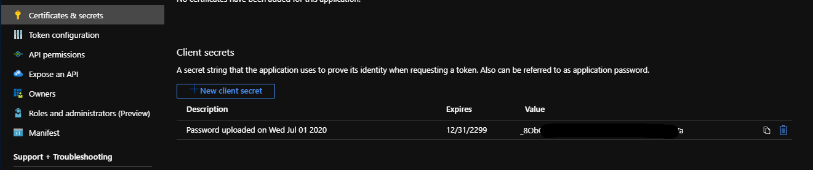

This file demonstarates how to register an app on OneDrive to generate the required tokens for C2 communication.

1. Go to url -  
	https://portal.azure.com/#blade/Microsoft_AAD_RegisteredApps/ApplicationsListBlade 

2. Create a new Application.  
	
	Give it any name and a valid url for redirect_url values.  

3. Grant the necessary API permissions  
	  

4. Generate Client Secret for application
	

